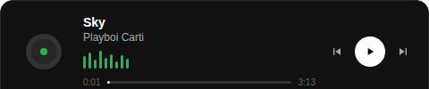

---

**Construindo coisas na web desde que descobri o `console.log`**

---

## 🧠 Sobre mim

- 🎓 Cursando **Análise e Desenvolvimento de Sistemas** na UNIFIA
- 💻 Apaixonado por **desenvolvimento Full Stack** — do banco de dados ao pixel
- 🌐 Gosto de criar experiências web que chamam atenção
- 🚀 Sempre explorando novas tecnologias e empurrando limites
- ☕ Movido a café e curiosidade

---

## 🛠️ Tech Stack

---

## 🎵 Ouvindo agora

  

---

## 📊 GitHub Stats

 

---

## 📬 Onde me achar

---

*"Código bom é aquele que você entende na segunda-feira de manhã."*

